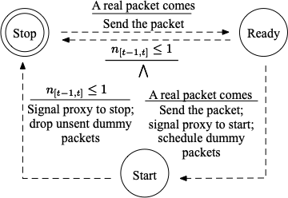
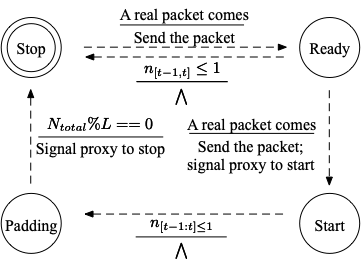

# WFDefProxy

## What?
WFDefProxy implements three defenses against Website Fingerprinting (WF) attack: FRONT [1], Tamaraw [2] and Random-WT [3]. 
It extends obfs4proxy [4], the state-of-the-art pluggable transport for Tor to circumvent censorship. 
It transforms the traffic between the client and the bridge according to a defense's protocol.
It makes use of the cryptographic system of obfs4 to do the handshake as well as to encrypt/decrypt the packets.
The workflow of WFDefProxy is shown in the figure below:
<div  align="center"> 

</div>

## Table of Contents
- [How to use?](#how-to-use-)
    * [To build:](#to-build-)
    * [To run **FRONT**](#to-run---front--)
    * [To run **Tamaraw**](#to-run---tamaraw--)
    * [To run **Random-WT**](#to-run---random-wt--)
- [How does WFDefProxy work?](#how-does-wfdefproxy-work-)
    * [Overview](#overview)
    * [Finite State Machine](#finite-state-machine)
    * [Core functions](#core-functions)
- [Tips and tricks](#tips-and-tricks)

<span id="how-to-use-">

## How to use? 

<span id="to-build-">

### To build:

```go build -o obfs4proxy/obfs4proxy ./obfs4proxy```

Suppose we put the compiled binary at `/Users/example/wfdef/obfs4proxy/obfs4proxy`.

</span>

<span id="to-run---front--">

### To run FRONT
The torrc configuration of bridge is like:
```
# Feel free to adapt the path.
DataDirectory /Users/example/tor-config/log-front-server  
Log notice stdout    
SOCKSPort 9052    
AssumeReachable 1    
PublishServerDescriptor 0    
Exitpolicy reject *:*    
ORPort auto   
ExtORPort auto
Nickname "wfdef"    
BridgeRelay 1    
ServerTransportListenAddr front 0.0.0.0:34000
ServerTransportPlugin front exec /Users/example/wfdef/obfs4proxy/obfs4proxy
ServerTransportOptions front w-min=1 w-max=13 n-client=3000 n-server=3000
```
It will generate a `front_bridgeline.txt` in `/Users/example/tor-config/log-front-server/pt_state`, 
containing a certification used for handshake as well as the configured parameters. 

The client's torrc file is like:
```
DataDirectory /Users/example/tor-config/log-front-client 
Log notice stdout    
SOCKSPort 9050  
ControlPort 9051  
UseBridges 1    
Bridge front 127.0.0.1:34000 cert=VdXiHCbwjXAC3+M2VZwasp+TAIbK0TuQD3MG3s024pE3brEygUOovIJo4f2oxZpBvlrNFQ w-min=1.0 w-max=13.0 n-server=3000 n-client=3000
ClientTransportPlugin front exec /Users/example/wfdef/obfs4proxy/obfs4proxy
```

You can launch Tor with command line `tor -f client-torrc` or replace Tor Browser's torrc file with it and launch the Tor Browser directly. 
Note that if is better to also include the relay's fingerprint in `Bridge` option due to some bugs of Tor Browser that may cause the launch failure.

</span>

<span id="to-run---tamaraw--">

### To run Tamaraw 
The torrc for bridge is similar as FRONT, except that last two lines should be 
```
ServerTransportPlugin tamaraw exec /Users/example/wfdef/obfs4proxy/obfs4proxy
ServerTransportOptions tamaraw rho-client=12 rho-server=4 nseg=200
```
Also, on the client side, the last two lines of the torrc file should be
```
Bridge front 127.0.0.1:34000 cert=VdXiHCbwjXAC3+M2VZwasp+TAIbK0TuQD3MG3s024pE3brEygUOovIJo4f2oxZpBvlrNFQ rho-client=12 rho-server=4 nseg=200
ClientTransportPlugin front exec /Users/example/wfdef/obfs4proxy/obfs4proxy
```
Replace `Bridge` with the information in `tamaraw_bridgeline.txt` in `/Users/example/tor-config/log-front-server/pt_state`.

</span>

<span id="to-run---random-wt--">

### To run Random-WT
The last two lines of torrc file for bridge:
```
ServerTransportPlugin randomwt exec /Users/example/wfdef/obfs4proxy/obfs4proxy
ServerTransportOptions randomwt n-client-real=4 n-server-real=45 n-client-fake=8 n-server-fake=90 p-fake=0.4
```
Similarly, the client side 
```
Bridge randomwt 127.0.0.1:34000 cert=VdXiHCbwjXAC3+M2VZwasp+TAIbK0TuQD3MG3s024pE3brEygUOovIJo4f2oxZpBvlrNFQ n-client-real=4 n-server-real=45 n-client-fake=8 n-server-fake=90 p-fake=0.4
ClientTransportPlugin randomwt exec /Users/example/wfdef/obfs4proxy/obfs4proxy
```
</span>

</span>

<span id="how-does-wfdefproxy-work-">

## How does WFDefProxy work?

<span id="overview">

### Overview
We nearly keep the framework of obfs4proxy unchanged, except that we add four different transports in `./transports`:
* **null**: do nothing but forward the packets between client and the bridge, can be used for collecting undefended datasets
* **front**: implement FRONT defense
* **tamaraw**: implement tamaraw defense
* **random-wt**: implement random-wt defense

The key modules for each transport:
* `packet.go`: define the packet format, the types of packets and how to parse the packets
* `statefile.go`: define the parameters, validity checks for the parameter values and the format of bridgeline.txt
* `[defense].go`: implement the defense, control the state transitions
*  `state.go`: define the states of the defense

</span>

<span id="finite-state-machine">

### Finite State Machine
Below are the state machines for three defenses on the client side (1.FRONT 2.Tamaraw 3.Random-WT).
<div  align="center"> 



</div>

The start and end of a defense is controlled by a finite state machine, where a event will trigger some actions and state transition.
We define that any **two packets** from upstream within 1s will cause the client enter the Start state from Stop state.
And we set a time window of 1s and keep observing the throughput when the defense is on. 
If there is no more than **one packet**, the defense will return to the Stop State (For Tamaraw, enter the Padding state).

On the bridge side, the start and stop of the defense is controlled by the client without such a state machine.
When client turns on/off the defense, it will send a signal packet to the bridge and trigger the corresponding actions.

</span>

<span id="core-functions">

### Core functions
To implement a transport (defense), we MUST have two core functions
* `func (conn *someDefenseConn) ReadFrom(r io.Reader) (written int64, err error)`:
  this function intercepts data from Tor, modifies the data according to the defense and forwards to the WFDefProxy on the other side.
* `func (conn *someDefenseConn) Read(b []byte) (n int, err error)`:
  this function receives data from the WFDefProxy on the other side, parses the defended packets and forwards to Tor.

</span>

</span>

<span id="tips-and-tricks">

## Tips and tricks
* There are two ways to get the trace via WFDefProxy: 
  * The first one is to simply add some logs about the time and bytes of the packets sent or received near the `conn.Write` or `Read` function. I have written some. 
   The logs can be found at `/Users/example/tor-config/log-[defense]-client/pt_state/obfs4proxy.log`.
   Make sure the log function is enabled. 
   You can check `./obfs4proxy/obfs4proxy.go` Line 315-316 to enable and adjust the level of logging.
  * The second way is to enable `traceLogger` which is defined in the front of `[defense].go`. 
    Any outside programme can signal traceLogger to start/stop logging the packet information via gRPC communication.
    You should modify the following parameters in the code (provide an address and enable `traceLogger`):
    ```
    gRPCAddr        = "localhost:10086"
	traceLogEnabled    = true
    ```
    The definition of a gRPC message can be found at `./transports/pb/traceLog.proto`:
    ```
    message SignalMsg {
      bool turnOn = 1;
      string filePath = 2;
    }
    ```
    When received a message with `turnOn=true`, WFDefProxy will log the packet information (timestamp, direction and size) to `filePath`.
    When received a message with `turnOn=false`, WFDefProxy will stop logging.
* WFDefProxy can be used together with AlexaCrawler, the toolkit we developed for crawling and parse traces.

</span>

## Dependencies

Build time library dependencies are handled by the Go module automatically.

If you are on Go versions earlier than 1.11, you might need to run `go get -d
./...` to download all the dependencies. Note however, that modules always use
the same dependency versions, while `go get -d` always downloads master.

* Go 1.11.0 or later. Patches to support up to 2 prior major releases will
  be accepted if they are not overly intrusive and well written.
* See `go.mod`, `go.sum` and `go list -m -u all` for build time dependencies.

## References
[1] [Gong, Jiajun, and Tao Wang. "Zero-delay Lightweight Defenses against Website Fingerprinting." 29th USENIX Security Symposium. 2020.](https://www.usenix.org/system/files/sec20-gong.pdf)

[2] [Cai, Xiang, et al. "A Systematic Approach to Developing and Evaluating Website Fingerprinting Defenses." Proceedings of the 2014 ACM SIGSAC Conference on Computer and Communications Security. 2014.](https://dl.acm.org/doi/pdf/10.1145/2660267.2660362)

[3] [Wang, Tao, and Ian Goldberg. "Walkie-Talkie: An Efficient Defense Against Passive Website Fingerprinting Attacks." 26th USENIX Security Symposium. 2017.](https://www.usenix.org/system/files/conference/usenixsecurity17/sec17-wang-tao.pdf)

[4] [Yawning, Angel. "obfs4 - The obfourscator"](https://github.com/Yawning/obfs4)

## Disclaimer
This repository is only intended for research purpose. 
Codes may have bugs.
We do not guarantee it secure against any attacker in the real world. 
Please be cautious if you want to use it in the real Tor network.

## Thanks
 * Yawning Angel for explaining the code of obfs4proxy